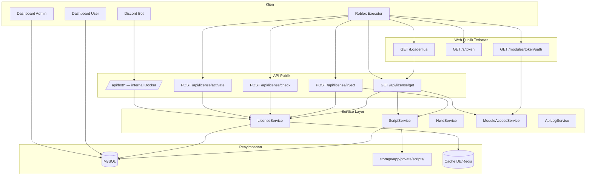
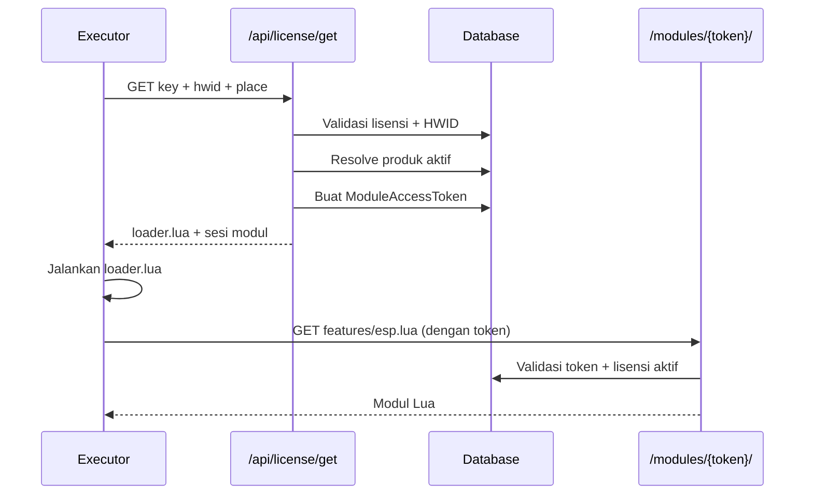

# WOLF License Server

Sistem manajemen lisensi software berbasis **Laravel 13**, dengan validasi HWID, distribusi script Lua untuk executor Roblox (Synapse, Solara, dll), dashboard admin/user, dan integrasi **Discord bot** untuk manajemen lisensi langsung dari server Discord. Seluruh stack dikemas dalam **Docker Compose** untuk kemudahan deployment.

[](https://www.php.net/)
[](https://laravel.com/)
[](https://www.docker.com/)
[](https://discord.js.org/)
[](https://opensource.org/licenses/MIT)

---

## Daftar Isi

- [Fitur Utama](#fitur-utama)
- [Tech Stack](#tech-stack)
- [Arsitektur Sistem](#arsitektur-sistem)
- [Konsep Inti](#konsep-inti)
- [Quick Start dengan Docker](#quick-start-dengan-docker)
- [Instalasi Manual](#instalasi-manual-tanpa-docker)
- [Konfigurasi Environment](#konfigurasi-environment)
- [API Lisensi](#api-lisensi)
- [Alur Executor Roblox](#alur-executor-roblox)
- [Discord Bot](#discord-bot)
- [Dashboard Web](#dashboard-web)
- [Keamanan](#keamanan)
- [Database](#database)
- [Testing](#testing)
- [Development](#development)
- [Deployment Production](#deployment-production)
- [Troubleshooting](#troubleshooting)
- [Lisensi](#lisensi)

---

## Fitur Utama

| Area | Fitur |
|------|--------|
| **Lisensi** | Generate single/bulk, format key `LZD-XXXXXX-XXXXXX-XXXXXX-XXXXXX`, lifetime atau berjangka |
| **HWID** | Binding otomatis saat aktivasi pertama, reset unlimited via dashboard user/admin |
| **Tipe lisensi** | `user` dan `admin` — menentukan produk script mana yang bisa diakses |
| **Produk & script** | Script lokal (`storage`) atau GitHub private repo (PAT), per-place atau universal |
| **API** | Activate, check, inject (token), get script (HttpGet) |
| **Discord Bot** | Dashboard GUI satu klik — generate key, reset HWID, get script, get stats |
| **Keamanan** | Rate limit, HTTPS production, token modul 6 jam, mask key di log API |
| **Dashboard** | Admin: lisensi, produk, user, log API, inject test. User: lisensi, reset HWID, download |
| **Logging** | API log, aktivitas lisensi, riwayat reset HWID |
| **Deployment** | Stack lengkap via Docker Compose (Laravel, MySQL, Queue, Nginx, Bot, ngrok) |

---

## Tech Stack

| Komponen | Versi |
|----------|--------|
| PHP | 8.3+ |
| Laravel | 13.x |
| MySQL | 8.x (recommended) |
| Tailwind CSS | 4.x |
| Vite | 8.x |
| Pest | 4.x (testing) |
| discord.js | v14 |
| Node.js | 20+ |

---

## Arsitektur Sistem



### Layer aplikasi (Laravel)

```
Backend/app/
├── Http/Controllers/
│   ├── Api/LicenseController.php      # Endpoint API lisensi
│   ├── Admin/                         # Dashboard admin
│   ├── User/                          # Dashboard user
│   └── Front/                         # Loader, modul, script token
├── Services/
│   ├── LicenseService.php             # Generate, aktivasi, validasi
│   ├── ScriptService.php              # Resolve produk + baca script
│   ├── HwidService.php                # Bind, touch, reset HWID
│   ├── ModuleAccessService.php        # Token sesi modul Lua
│   └── ApiLogService.php              # Logging request API
├── Repositories/
│   ├── LicenseRepository.php          # Cache lookup lisensi
│   └── ProductRepository.php
└── Models/
    ├── License.php
    ├── Product.php
    ├── ModuleAccessToken.php
    ├── ScriptToken.php
    └── ApiLog.php
```

### Struktur Discord Bot

```
Bot_Server/
├── bot.js                          # Entry point utama
├── config/
│   └── index.js                    # Load & validasi environment variables
├── services/
│   └── laravelService.js           # Semua HTTP request ke Laravel API (Axios)
├── dashboard/
│   └── panel.js                    # Embed & ActionRow tombol dashboard
├── interactions/
│   ├── buttons/
│   │   ├── getStats.js
│   │   ├── resetHwid.js
│   │   ├── getScript.js
│   │   └── generateKey.js          # Cek role admin + trigger modal
│   └── modals/
│       └── generateKeyModal.js     # Handle submit modal generate key
└── utils/
    └── replyHelper.js              # Embed standar sukses/error/forbidden
```

---

## Konsep Inti

### Lisensi ≠ Produk

Setelah refactor, **lisensi tidak terikat ke satu produk** (`product_id` selalu `null` saat generate). Akses script ditentukan oleh:

1. **`license_type`** pada lisensi (`user` | `admin`)
2. **Produk aktif** di database yang cocok dengan `place_id` dari executor
3. **`access_level`** pada produk (`user` | `admin`)

### Aturan akses script

| Tipe lisensi | Produk `access_level: user` | Produk `access_level: admin` |
|--------------|------------------------------|-------------------------------|
| `user` | ✅ Bisa akses | ❌ Ditolak |
| `admin` | ✅ Bisa akses | ✅ Bisa akses (diprioritaskan) |

### Prioritas resolve produk (`ScriptService::resolveForLicense`)

1. Produk **spesifik** yang `place_ids`-nya cocok dengan `place_id` executor
2. Fallback ke produk **universal** (`place_ids` kosong)
3. Tidak ada produk cocok → script tidak diserve

### Format license key

```
LZD-FC8198-3661ED-2A72BA-16FCA3
│   │      │      │      └── segment 4 (6 hex)
│   │      │      └───────── segment 3
│   │      └──────────────── segment 2
│   └─────────────────────── segment 1
└── prefix tetap
```

Total panjang: **31 karakter**. Digenerate dengan `random_bytes()` (kriptografis aman).

### Status lisensi

| Status | Deskripsi |
|--------|-----------|
| `active` | Valid, belum expired |
| `expired` | Melewati `expired_at` atau di-mark otomatis |
| `suspended` | Dinonaktifkan sementara oleh admin |
| `banned` | Diblokir permanen |

---

## Quick Start dengan Docker

Cara tercepat dan paling direkomendasikan untuk menjalankan seluruh stack (Laravel, MySQL, Queue Worker, Nginx, Discord Bot, ngrok) sekaligus.

### Prasyarat

- [Docker Desktop](https://www.docker.com/products/docker-desktop/) atau Docker Engine + Compose v2
- **Windows:** jalankan script bash di **Git Bash** atau **WSL**
- Akun [ngrok](https://ngrok.com/) (gratis) jika ingin testing Roblox executor dari luar jaringan lokal

### Langkah-langkah

```bash
# 1. Clone & masuk ke folder project
git clone https://github.com/username/script-lisensi.git
cd SCRIPT_LISENSI

# 2. Setup pertama kali (build image, migrate DB, generate APP_KEY)
chmod +x setup.sh start.sh stop.sh
./setup.sh

# 3. Isi kredensial Discord di Bot_Server/.env
#    DISCORD_TOKEN, CLIENT_ID, DASHBOARD_CHANNEL_ID, ADMIN_ROLE_ID

# 4. (Opsional) Isi NGROK_AUTHTOKEN di .env root untuk testing Roblox

# 5. Jalankan stack
./start.sh
```

Akses aplikasi:

- **Lokal:** http://localhost:8000
- **Admin dashboard:** http://localhost:8000/admin/dashboard
- **User dashboard:** http://localhost:8000/user/dashboard
- **ngrok dashboard:** http://localhost:4040 (jika ngrok aktif)

### Daftar service

| Service | Container | Port Host | Fungsi |
|---------|-----------|-----------|--------|
| `mysql` | sl-mysql | 3306 | Database MySQL 8 |
| `backend` | sl-backend | — (internal) | Laravel PHP-FPM |
| `queue` | sl-queue | — | `php artisan queue:work` |
| `nginx` | sl-nginx | 8000 | Web server + static files |
| `bot` | sl-bot | — | Discord bot (Node.js) |
| `ngrok` | sl-ngrok | 4040 | Tunnel publik (profile opsional) |

### Perintah sehari-hari

```bash
# Jalankan semua service (+ ngrok jika NGROK_AUTHTOKEN terisi)
./start.sh

# Stop semua container (termasuk ngrok)
./stop.sh

# Lihat log
docker compose logs -f
docker compose logs -f bot
docker compose logs -f backend
docker compose logs -f nginx

# Restart service tertentu
docker compose restart bot
docker compose restart backend queue

# Artisan di dalam container
docker compose exec backend php artisan migrate --force
docker compose exec backend php artisan db:seed
docker compose exec backend php artisan config:clear
docker compose exec backend php artisan cache:clear

# Cek status container
docker compose ps
```

> 📘 Panduan Docker lengkap (arsitektur, ngrok, production override, troubleshooting) tersedia di [`DOCKER.md`](./DOCKER.md).

---

## Instalasi Manual (tanpa Docker)

### Prasyarat

- PHP 8.3+ dengan ekstensi: `pdo_mysql`, `mbstring`, `openssl`, `tokenizer`, `xml`, `ctype`, `json`, `bcmath`
- Composer 2.x
- Node.js 20+ & npm
- MySQL 8.x

### Langkah instalasi

```bash
# 1. Clone & masuk direktori
cd Backend

# 2. Install dependensi
composer install
npm install

# 3. Environment
cp .env.example .env
php artisan key:generate

# 4. Edit .env — set DB_* dan APP_URL

# 5. Database
php artisan migrate
php artisan db:seed

# 6. Build assets
npm run build

# 7. Jalankan server
php artisan serve
```

Atau gunakan script composer:

```bash
composer run setup
```

### Akun default (setelah seed)

| Role | Email | Password |
|------|-------|----------|
| Admin | `admin@example.com` | `password` |
| User | `user@example.com` | `password` |

> ⚠️ Ganti password segera setelah instalasi production.

---

## Konfigurasi Environment

### Root `.env` (Docker — dari `.env.docker.example`)

| Variabel | Default | Keterangan |
|----------|---------|------------|
| `APP_PORT` | 8000 | Port host → nginx |
| `MYSQL_PORT` | 3306 | Port host → MySQL |
| `NGROK_UI_PORT` | 4040 | Web UI ngrok |
| `MYSQL_ROOT_PASSWORD` | — | Password root MySQL |
| `MYSQL_DATABASE` | script_lisensi | Nama database |
| `MYSQL_USER` / `MYSQL_PASSWORD` | — | User aplikasi |
| `DISCORD_BOT_API_TOKEN` | auto-generate | Token shared Bot ↔ Laravel |
| `NGROK_AUTHTOKEN` | — | Token ngrok (wajib untuk tunnel Roblox) |
| `BACKEND_BUILD_TARGET` | production | `production` atau `development` |

### `Backend/.env`

```env
APP_NAME="WOLF License"
APP_URL=https://domain-anda.com      # Harus HTTPS di production
APP_ENV=production
APP_DEBUG=false

DB_CONNECTION=mysql
DB_HOST=127.0.0.1
DB_PORT=3306
DB_DATABASE=script_lisensi
DB_USERNAME=root
DB_PASSWORD=

CACHE_STORE=database               # atau redis untuk performa lebih baik
SESSION_DRIVER=database
```

Opsional — jika produk memakai `script_source: github`:

```env
GITHUB_PAT=ghp_xxxxxxxxxxxxxxxxxxxx
```

Buat PAT di GitHub → Settings → Developer settings → Fine-grained token dengan scope **Contents: Read-only** pada repo target.

### `Bot_Server/.env`

| Variable | Keterangan |
|---|---|
| `DISCORD_TOKEN` | Token bot dari Discord Developer Portal |
| `CLIENT_ID` | Application Client ID bot |
| `DASHBOARD_CHANNEL_ID` | ID channel tempat dashboard ditampilkan |
| `ADMIN_ROLE_ID` | ID role yang boleh generate key |
| `LARAVEL_API_URL` | Base URL Web API Laravel (gunakan `http://nginx` jika via Docker) |
| `LARAVEL_API_TOKEN` | Bearer token untuk autentikasi ke Laravel |
| `LARAVEL_API_TIMEOUT` | (opsional) timeout request dalam ms, default 8000 |

> ⚠️ **Jangan** set `LARAVEL_API_URL` ke URL ngrok — ngrok bisa mati/berubah subdomain dan bot akan error HTTP 404. Gunakan `http://nginx` (internal Docker) atau URL internal stabil lainnya.

---

## API Lisensi

Base URL: `{APP_URL}/api/license`

Semua endpoint API:
- Response JSON (kecuali `get` yang return Lua plaintext)
- Rate limit: **60 request/menit per IP**
- Header: `Content-Type: application/json` (untuk POST)

### POST `/api/license/activate`

Aktivasi lisensi dan bind HWID (pertama kali) atau validasi HWID (selanjutnya).

**Request body:**
```json
{
  "key": "LZD-FC8198-3661ED-2A72BA-16FCA3",
  "hwid": "HWID-DEVICE-12345"
}
```

**Response sukses (200):**
```json
{ "status": true, "message": "Activated" }
```

**Error:**
| HTTP | Kondisi |
|------|---------|
| 404 | Key tidak ditemukan |
| 403 | HWID tidak cocok / banned / suspended |
| 410 | Lisensi expired |
| 422 | Format key/HWID tidak valid |
| 429 | Rate limit |

### POST `/api/license/check`

Validasi lisensi tanpa aktivasi ulang. Tetap update `last_used_at`.

**Request body:** sama dengan activate.

**Response sukses:**
```json
{ "status": true }
```

### GET `/api/license/get` ⭐ Direkomendasikan

Endpoint utama untuk executor Roblox via `game:HttpGet()`. Mengembalikan **Lua script plaintext** langsung.

**Query parameters:**

| Param | Wajib | Deskripsi |
|-------|-------|-----------|
| `key` | ✅ | License key |
| `hwid` | ✅ | Hardware/device ID (min 4 karakter) |
| `username` | ❌ | Username Roblox |
| `place` | ❌ | Roblox Place ID |

**Contoh:**
```
GET /api/license/get?key=LZD-FC8198-3661ED-2A72BA-16FCA3&hwid=12345678&username=PlayerName&place=8775573954
```

**Response sukses:** Lua script (`Content-Type: text/plain`), disisipi sesi modul di awal:
```lua
-- WOLF protected session
_G.WOLF_MODULE_TOKEN = "abc123..."
_G.WOLF_BASE_URL = "https://domain.com/modules/abc123..."
```

**Response gagal:** Lua error string (HTTP 200 agar executor tidak throw network error):
```lua
error("[WOLF] License key tidak ditemukan.")
```

### POST `/api/license/inject` (Legacy)

Validasi lisensi, simpan info Roblox, kembalikan URL token sekali pakai.

**Request body:**
```json
{
  "key": "LZD-FC8198-3661ED-2A72BA-16FCA3",
  "hwid": "HWID-DEVICE-12345",
  "roblox_username": "PlayerName",
  "place_id": "8775573954"
}
```

**Response sukses:**
```json
{
  "status": true,
  "map": "universal",
  "script_url": "https://domain.com/s/a1b2c3d4..."
}
```

Client kemudian: `game:HttpGet(script_url)` → script dari `/s/{token}` (TTL 30 detik, sekali pakai).

### Endpoint modul (internal, otomatis)

```
GET /modules/{token}/{path}
```

- `{token}` = 64 karakter hex dari sesi modul (dibuat otomatis saat get/inject sukses)
- `{path}` = path relatif modul, mis. `features/esp.lua`
- TTL token: **6 jam**
- Rate limit: 120 req/menit per IP
- `loader.lua` **diblokir** di endpoint ini

---

## Alur Executor Roblox

### Metode 1 — Langsung (direkomendasikan)

```lua
local key = "LZD-FC8198-3661ED-2A72BA-16FCA3"
local hwid = tostring(game:GetService("Players").LocalPlayer.UserId)
local username = game:GetService("Players").LocalPlayer.Name
local place = tostring(game.PlaceId)

local url = "https://DOMAIN/api/license/get"
    .. "?key=" .. key
    .. "&hwid=" .. hwid
    .. "&username=" .. username
    .. "&place=" .. place

loadstring(game:HttpGet(url))()
```

### Metode 2 — Via Loader.lua

```lua
getgenv().script_key = "LZD-FC8198-3661ED-2A72BA-16FCA3"
loadstring(game:HttpGet("https://DOMAIN/Loader.lua"))()
```

`Loader.lua` membaca `script_key` dari `getgenv()` / `_G`, lalu memanggil `/api/license/get` secara internal.

### Diagram alur lengkap



### Struktur script Lua

Script disimpan di:

```
storage/app/private/scripts/
└── universal/                    # contoh folder produk
    ├── loader.lua                # Entry point (WAJIB ada)
    ├── core/
    │   ├── services.lua
    │   └── connections.lua
    ├── features/
    │   ├── esp.lua
    │   ├── fly.lua
    │   └── ...
    ├── ui/
    └── utils/
```

**Aturan folder:**
- Setiap produk lokal harus punya **`loader.lua`** di root folder-nya
- Nama folder = nilai `script_folder` pada produk di admin
- Modul di-load via URL: `/modules/{token}/features/esp.lua`
- **`loader.lua` tidak bisa diakses langsung** via endpoint modul (hanya lewat API berlisensi)

**Produk admin terpisah:** buat folder sendiri (mis. `admin-tools/`), set `access_level: admin` dan `script_folder: admin-tools` pada produk. Jangan gunakan folder yang sama untuk produk user dan admin jika ingin fitur benar-benar terpisah.

---

## Discord Bot

Bot Discord "Dashboard GUI Statis Satu Klik" untuk manajemen lisensi, terintegrasi dengan Web API Laravel via **discord.js v14** + **Axios**.

### Fitur

- Dashboard berbentuk Embed + 4 tombol persistent (tidak dobel, otomatis di-edit jika kode berubah)
- Semua respon ke user bersifat privat (`ephemeral: true`)
- 🔑 **Generate Key** — khusus role Admin/Reseller, via Modal input durasi hari
- 🔄 **Reset HWID** — reset HWID lisensi milik user yang klik
- 📜 **Get Script** — kirim script loader langsung tanpa hit API
- 📊 **Get Stats** — tampilkan detail status lisensi user
- Error handling ketat: jika Laravel API down/timeout, bot tidak crash dan memberi pesan ramah

### Instalasi (di luar Docker)

```bash
cd Bot_Server
npm install
cp .env.example .env
# isi .env sesuai tabel di atas
npm start

# mode development dengan auto-restart
npm run dev
```

### Permission & Intents Discord

Bot **tidak memerlukan privileged intent** apa pun (tidak membaca isi pesan user). Pastikan bot memiliki permission di channel dashboard:
- `View Channel`
- `Send Messages`
- `Embed Links`
- `Read Message History` (untuk cek pesan lama agar tidak dobel)

### Kontrak API yang diharapkan bot

**GET** `/api/license/stats?discord_id=...`
```json
{
  "message": "OK",
  "data": {
    "key": "XXXX-XXXX-XXXX",
    "status": "active",
    "hwid": "ABC123...",
    "expires_at": "2026-12-31"
  }
}
```

**POST** `/api/license/reset-hwid` — Body: `{ "discord_id": "..." }`
```json
{ "message": "HWID berhasil direset." }
```

**POST** `/api/license/generate` — Body: `{ "discord_id": "...", "duration_days": 30 }`
```json
{
  "message": "Key berhasil dibuat",
  "data": { "key": "NEW-KEY-XXXX" }
}
```

Semua request membawa header:
```
Authorization: Bearer <LARAVEL_API_TOKEN>
```

### Menambah tombol baru

1. Buat file handler baru di `interactions/buttons/namaTombol.js`
2. Tambahkan tombolnya di `dashboard/panel.js` (di `BUTTON_IDS` dan `buildDashboardButtons`)
3. Daftarkan mapping `customId -> handler` di `bot.js` pada object `buttonHandlers`

Tidak perlu register Slash Command apa pun — arsitektur ini murni berbasis Button & Modal interaction.

---

## Dashboard Web

### Admin (`/admin`)

| Route | Fungsi |
|-------|--------|
| `/admin/dashboard` | Ringkasan statistik |
| `/admin/licenses` | CRUD lisensi, generate bulk, export CSV |
| `/admin/licenses/{id}` | Detail lisensi, log API, reset HWID |
| `/admin/products` | Kelola produk & konfigurasi script |
| `/admin/users` | Kelola user, toggle aktif |
| `/admin/api-logs` | Log semua request API |
| `/admin/activities` | Log aktivitas sistem |
| `/admin/inject-test` | Simulasi alur inject (debug) |

Middleware: `auth` + `active` + `admin`

### User (`/user`)

| Route | Fungsi |
|-------|--------|
| `/user/dashboard` | Dashboard user |
| `/user/licenses` | Daftar lisensi milik user |
| `/user/licenses/{id}/reset-hwid` | Reset HWID (unlimited) |
| `/user/licenses/{id}/download` | Download script (butuh login) |
| `/user/profile` | Edit profil & password |

Middleware: `auth` + `active`

---

## Keamanan

### Yang sudah diimplementasi

| Fitur | Detail |
|-------|--------|
| HWID binding | Lisensi terkunci ke perangkat pertama yang aktivasi |
| Rate limiting | API 60/min, modul 120/min per IP |
| Token modul | Akses `/modules/` butuh token sesi 6 jam + lisensi aktif |
| Blokir loader via modul | `loader.lua` tidak bisa di-scrape lewat `/modules/` |
| HTTPS wajib | Production redirect HTTP→HTTPS, `URL::forceScheme('https')` |
| Mask key di log | API log menyimpan `LZD-FC8198-****-****-****-16FCA3` |
| Path traversal | Sanitasi path modul + validasi `realpath()` |
| Akses user/admin | Produk admin-only tidak bisa diakses lisensi user |
| Cache invalidation | Cache lisensi di-flush saat update |

### Reset HWID

Reset HWID **tidak dibatasi** (by design) — user bisa reset kapan saja dan berapa kali pun via dashboard.

### Catatan keamanan

- License key di URL GET (`/api/license/get?key=...`) diperlukan karena keterbatasan `HttpGet` di Roblox. Mitigasi: **wajib HTTPS** + key dimasker di log server.
- Setelah script berjalan di executor, dump memory tetap mungkin — ini batasan umum script Lua, bukan celah server.
- Download script dari dashboard user memerlukan autentikasi + lisensi aktif.

### Keamanan deployment

- Jangan commit file `.env`, `Backend/.env`, `Bot_Server/.env`
- Gunakan password kuat untuk MySQL di production
- ngrok mengekspos seluruh aplikasi ke internet — gunakan hanya untuk development/staging
- `DISCORD_BOT_API_TOKEN` harus random dan kuat

---

## Database

### Tabel utama

| Tabel | Deskripsi |
|-------|-----------|
| `users` | Akun admin & user dashboard |
| `licenses` | License key, HWID, status, tipe, info Roblox |
| `products` | Konfigurasi script, access level, place IDs |
| `module_access_tokens` | Token sesi akses modul Lua (TTL 6 jam) |
| `script_tokens` | Token sekali pakai untuk alur inject legacy |
| `api_logs` | Log semua request API |
| `license_activities` | Audit trail aktivitas lisensi |
| `hwid_reset_logs` | Riwayat reset HWID |

### Relasi penting

```
users ──< licenses (user_id, nullable)
licenses ──< module_access_tokens
licenses ──< script_tokens
licenses ──< api_logs
licenses ──< hwid_reset_logs
products (standalone — tidak FK ke licenses)
```

---

## Testing

Proyek menggunakan **Pest 4**.

```bash
# Semua test
php artisan test

# Test spesifik
php artisan test --filter=LicenseActivate
php artisan test --filter=ScriptAccess
php artisan test --filter=ModuleSecurity
```

### Suite test yang tersedia

| File | Cakupan |
|------|---------|
| `LicenseActivateTest` | Aktivasi, HWID, expired, banned, rate limit |
| `LicenseCheckTest` | Validasi check endpoint |
| `LicenseGetScriptTest` | GET script, error handling |
| `ScriptAccessTest` | Kontrol akses user vs admin |
| `ModuleSecurityTest` | Token modul, blokir loader, mask key |

---

## Development

```bash
# Dev server + queue + vite sekaligus
composer run dev

# Atau manual
php artisan serve
npm run dev
```

### Perintah berguna

```bash
php artisan route:list                    # Lihat semua route
php artisan migrate                       # Jalankan migrasi
php artisan db:seed                       # Seed data demo
php artisan test --compact                # Jalankan test
vendor/bin/pint --dirty                   # Format kode PHP
```

### Menambah produk script baru

1. Buat folder di `storage/app/private/scripts/{nama-folder}/`
2. Letakkan `loader.lua` di dalamnya
3. Admin → Produk → Tambah Produk
4. Set `script_folder`, `access_level`, `place_ids` (kosong = universal)
5. Test via Admin → Inject Test

---

## Deployment Production

### Checklist

- [ ] `APP_ENV=production`, `APP_DEBUG=false`
- [ ] `APP_URL` pakai `https://`
- [ ] SSL certificate aktif
- [ ] `php artisan migrate --force`
- [ ] `npm run build`
- [ ] `php artisan config:cache`
- [ ] `php artisan route:cache`
- [ ] `php artisan view:cache`
- [ ] Ganti password akun seed default
- [ ] Set `GITHUB_PAT` jika pakai script GitHub
- [ ] Pastikan folder `storage/` writable oleh web server

### Via Docker

```bash
docker compose -f docker-compose.yml -f docker-compose.prod.yml up -d --build
```

Perbedaan production:
- MySQL **tidak** exposed ke host
- `APP_DEBUG=false`, `restart: always`
- Migrasi **tidak** otomatis — jalankan manual:

```bash
docker compose -f docker-compose.yml -f docker-compose.prod.yml exec backend php artisan migrate --force
```

**Redis (opsional):**
```bash
docker compose --profile with-redis up -d
```

### Web server manual (tanpa Docker)

Document root harus mengarah ke folder `public/`, bukan root proyek.

**Nginx contoh:**
```nginx
server {
    listen 443 ssl;
    server_name domain-anda.com;
    root /var/www/script_lisensi/public;

    add_header X-Frame-Options "SAMEORIGIN";
    add_header X-Content-Type-Options "nosniff";

    index index.php;
    charset utf-8;

    location / {
        try_files $uri $uri/ /index.php?$query_string;
    }

    location ~ \.php$ {
        fastcgi_pass unix:/var/run/php/php8.3-fpm.sock;
        fastcgi_param SCRIPT_FILENAME $realpath_root$fastcgi_script_name;
        include fastcgi_params;
    }
}
```

---

## Troubleshooting

### Aplikasi & Script

| Gejala | Penyebab | Solusi |
|--------|----------|--------|
| Script tidak muncul di executor | Tidak ada produk aktif yang cocok | Pastikan ada produk aktif dengan `script_folder` benar, cek `loader.lua` ada, cek tipe lisensi cocok `access_level` |
| Error "Sesi modul tidak valid" | Token modul expired (6 jam) atau lisensi expired/banned | Jalankan ulang loader dari awal |
| Error 500 saat aktivasi | Migrasi belum lengkap | Jalankan `php artisan migrate`, cek `storage/logs/laravel.log` |
| Perubahan UI tidak muncul | Asset belum di-build | `npm run build` (atau `npm run dev` untuk development) |
| Rate limit 429 | Lebih dari 60 req/menit per IP | Tunggu 1 menit atau gunakan IP berbeda |

### Docker & Infrastruktur

| Gejala | Penyebab | Solusi |
|--------|----------|--------|
| Halaman tanpa CSS via ngrok | Asset Vite tidak ada di `Backend/public/build/` | Jalankan ulang `./start.sh` atau `./setup.sh` |
| Halaman tanpa CSS (localhost:5173) | Mode dev Vite aktif (`public/hot`) | Hapus `Backend/public/hot`, gunakan `./start.sh` |
| Bot Discord: **Gagal HTTP 404** | `LARAVEL_API_URL` mengarah ke ngrok mati | Set `LARAVEL_API_URL=http://nginx` di `Bot_Server/.env`, restart bot |
| Bot: token tidak valid | Token tidak sinkron | Pastikan `DISCORD_BOT_API_TOKEN` = `LARAVEL_API_TOKEN` |
| 502 Bad Gateway | Backend belum siap / PHP-FPM gagal start | `docker compose logs backend`, tunggu healthcheck MySQL |
| `/build/manifest.json` 404 | Asset belum disalin ke volume nginx | `./start.sh` (auto-copy dari image) |
| DB connection refused | MySQL masih starting | Tunggu atau cek `docker compose logs mysql` |
| `exec docker-entrypoint.sh: no such file or directory` | Script punya CRLF line ending (editor Windows) | Konversi ke LF (`dos2unix`), tambahkan `.gitattributes` |

### Verifikasi Bot ↔ Backend

```bash
# Dari host
curl -H "Authorization: Bearer TOKEN_ANDA" http://localhost:8000/api/bot/health

# Dari container bot
docker compose exec bot wget -qO- --header="Authorization: Bearer TOKEN_ANDA" http://nginx/api/bot/health
```

Respon sukses: `{"status":true,...}`

### Verifikasi Asset CSS

```bash
curl -I http://localhost:8000/build/manifest.json
# Harus HTTP 200
```

---

## Referensi File Docker

| File | Fungsi |
|------|--------|
| `docker-compose.yml` | Definisi service base |
| `docker-compose.local.yml` | Override dev + ngrok |
| `docker-compose.prod.yml` | Override production |
| `setup.sh` | Setup pertama kali |
| `start.sh` | Start stack harian |
| `stop.sh` | Stop semua container |
| `docker/scripts/common.sh` | Helper compose & env sync |
| `docker/scripts/update-env-url.sh` | Sync URL ngrok → APP_URL |
| `docker/nginx/conf.d/default.conf` | Konfigurasi nginx |
| `docker/backend/Dockerfile` | Image Laravel (build Vite + Composer) |
| `docker/bot/Dockerfile` | Image Discord bot |

> 📘 Detail lengkap arsitektur Docker, variabel environment, dan setup ngrok ada di [`DOCKER.md`](./DOCKER.md).

---

## Lisensi

Proyek ini menggunakan [MIT license](https://opensource.org/licenses/MIT).